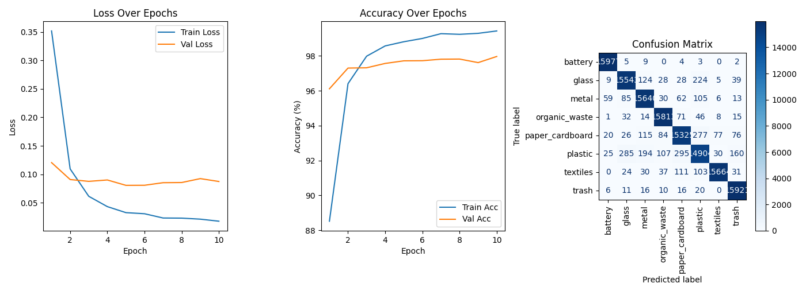
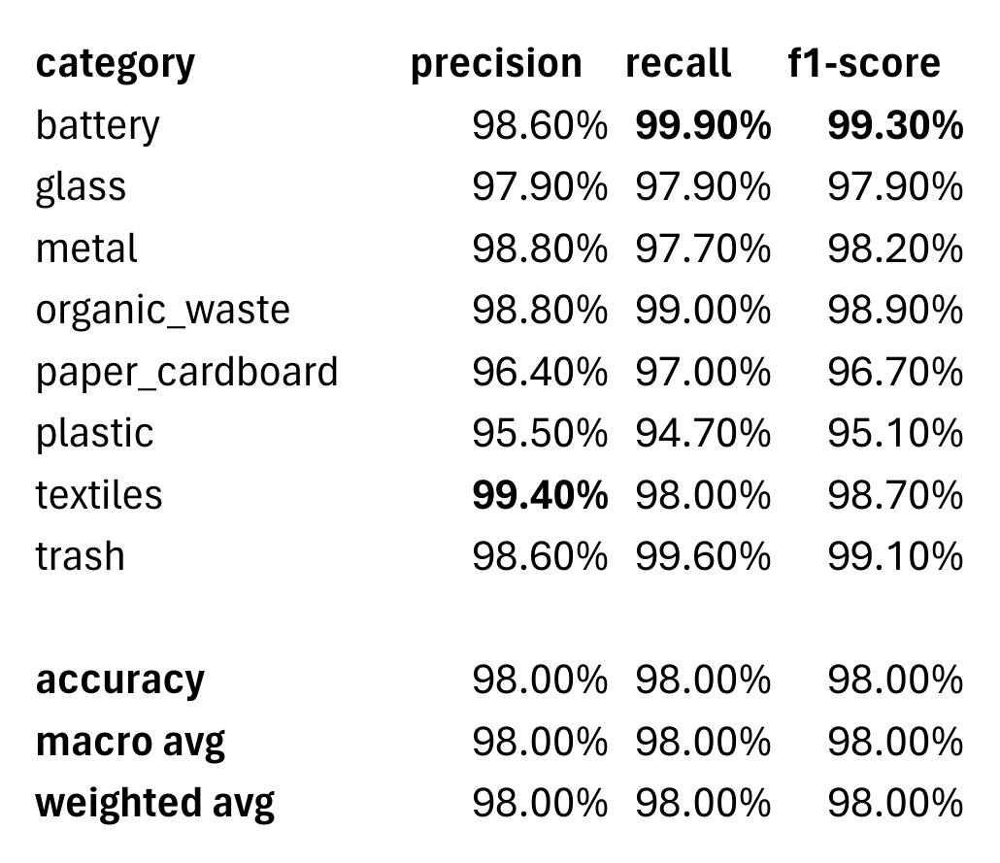
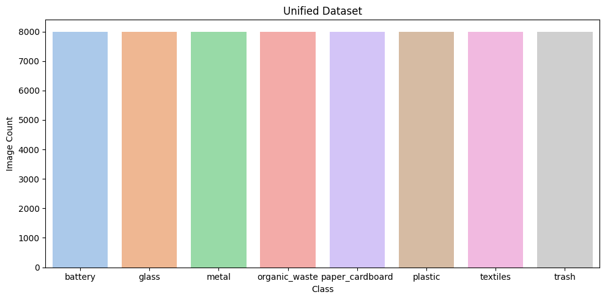

# Garbage-Crew

# Smart Waste Sorter — Trash, Compost & Recycling Classifier

This project is an **AI-powered automated waste sorting system** that classifies waste items into **Trash**, **Compost**, or **Recycling** categories using a fine-tuned image classification model.

The system is deployed on a **Raspberry Pi** integrated with a **LEGO Mindstorms EV3** controller that operates a **motorized trapdoor mechanism**. This mechanism physically directs waste items into the correct bin based on AI predictions. The project showcases a practical application of **AI combined with robotics** to improve sorting efficiency, reduce contamination in waste streams, and enable scalable, real-world implementations.

### Results




---

## Features

-   Real-time image classification using a fine-tuned **MobileNetV3** model, with optional integration of **YOLOv11n** for object detection and improved localization.
-   Model trained on a comprehensive and diverse dataset covering multiple waste categories: Trash, Compost, Recycling, and subcategories such as battery, glass, metal, organic waste, paper/cardboard, plastic, textiles.
-   Support for quantized model deployment, enabling low-latency inference on resource-constrained edge devices like Raspberry Pi.
-   Integration with LEGO EV3 hardware to automate physical sorting via motor-controlled trapdoors.
-   Modular software architecture allowing flexible swapping of models, detection methods, and hardware interfaces.
-   Snapshot mode to freeze video feed for detailed inspection or debugging.
-   Real-time FPS monitoring for performance evaluation.
-   Cross-platform support with seamless CPU/GPU device detection and optimized threading for quantized inference.

---

## Hardware Requirements (Tested Setup)

-   Raspberry Pi 4 (or equivalent ARM-based Linux system)
-   Raspberry Pi Camera Module V2 (8 Megapixel, 1080p)
-   LEGO Mindstorms EV3 brick
-   EV3 compatible motors and cables for trapdoor actuation
-   Necessary connecting hardware to interface Pi and EV3 (e.g., USB, Bluetooth, or direct wiring)

---

## Software Requirements

-   Python 3.9+
-   PyTorch (version 1.12+ recommended)
-   Torchvision (for pretrained model and transforms)
-   OpenCV (`opencv-python`) for video capture and rendering
-   `ultralytics` package (optional; required for YOLOv11n integration)
-   ev3dev2 Python library (for EV3 motor control)
-   NumPy

---

## System Workflow

1. The Raspberry Pi camera captures live video frames of incoming waste items.
2. If enabled, YOLOv11n detects bounding boxes around individual objects for focused classification.
3. Each detected crop (or the full frame if YOLO is disabled) is preprocessed and fed into the MobileNetV3 classification model.
4. The model predicts the waste category for each object.
5. Based on classification, the Raspberry Pi sends commands to the EV3 brick to actuate the corresponding trapdoor motor.
6. The trapdoor mechanism physically sorts the item into the designated bin (Trash, Compost, or Recycling).
7. Optional snapshot mode allows pausing live feed to review and debug classifications.

---

## Model Optimization and Deployment

-   Models can be run in full precision or quantized modes; quantization significantly reduces model size and increases inference speed on CPUs with minimal accuracy loss.
-   The MobileNetV3 model is fine-tuned on a custom dataset tailored for waste classification and exported as a TorchScript module for efficient deployment.
-   Quantized models leverage PyTorch’s native quantization API and are scripted via TorchScript to enable seamless JIT compilation.
-   Multi-threading settings are adjusted dynamically to optimize CPU usage on Raspberry Pi.

---

## Dataset

The model was trained on a unified and curated dataset combining multiple waste classification datasets, covering a broad range of waste types to improve generalization and accuracy.

Access the dataset here:
[Unified Waste Classification Dataset - Kaggle](https://www.kaggle.com/datasets/siddhantmaji/unified-waste-classification-dataset)

#### Dataset Class Distribution:



---

## Usage Instructions

1. Install required dependencies:

```bash
pip install -r requirements.txt
```

2. Clone the repository:

```bash
git clone https://github.com/Garbage-Crew/Garbage-Crew.git
cd Garbage-Crew
```

3. Run the garbage classifier:

```bash
python garbage_classifier.py [--quantized] [--yolo] [--snapshot] [--pretrained]
```
